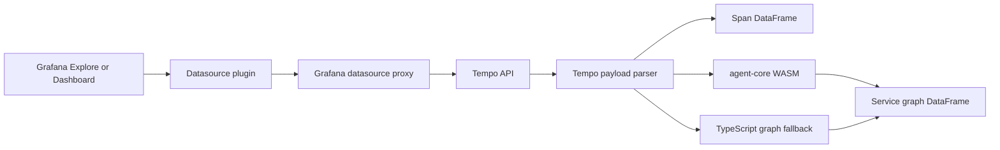

# Architecture

`vaduga-mapgl-datasource` is a Grafana frontend datasource plugin for trace and service graph debugging. The plugin queries Tempo through Grafana's datasource proxy and returns Grafana DataFrames that can be inspected in dashboards or consumed by graph panels.

## Runtime Flow



The datasource supports two query paths:

1. Trace ID query: fetches one trace from `/api/traces/{traceId}`.
2. Time range query: searches `/api/search`, extracts trace IDs, then fetches each trace.

When a TraceQL query is provided, the time range query passes it to Tempo search as `q`. A non-empty trace ID takes precedence and skips search.

Tempo requests are routed through Grafana's proxy using the datasource UID. The browser does not call Tempo directly.

## Source Layout

- `src/DataSource.ts`: Grafana datasource implementation, Tempo request orchestration, and DataFrame creation.
- `src/tempoSearch.ts`: builds Tempo search parameters, including optional TraceQL passthrough.
- `src/tempoParser.ts`: converts Tempo OTLP JSON into normalized trace/span objects and parses service graph JSON.
- `src/wasmBridge.ts`: initializes the Rust WASM bundle and exposes graph extraction.
- `src/components/QueryEditor.tsx`: Grafana query editor for trace ID, TraceQL, limit, and result mode.
- `src/types.ts`: datasource query and JSON configuration types.
- `agent-core/src/service_graph.rs`: Rust WASM service graph extraction.
- `agent-core/src/trace_branch_analysis.rs`: indexed trace-branch extraction and directed link-cost reduction.
- `agent-core/src/trace_analyzer.rs`: trace analysis types and logic kept for trace-oriented analytics.
- `otel-mock/`: local OTLP trace generator used by Docker Compose.

## Query Modes

### Spans

The `spans` mode returns one row per span.

Fields:

- `traceId`: trace identifier.
- `spanId`: span identifier.
- `parentId`: parent span identifier when present.
- `serviceName`: service name from resource attributes or span attributes.
- `operationName`: span name.
- `startTime`: span start timestamp in milliseconds.
- `duration`: span duration in milliseconds.
- `status`: `OK` or `ERROR`.
- `attributes`: JSON string with normalized span attributes.

### Service Graph

The `serviceGraph` mode returns service nodes and directed dependency edges.

Fields:

- `type`: `service` or `edge`.
- `serviceName`: service node name for service rows.
- `source`: source service for edge rows.
- `target`: target service for edge rows.

Edges are derived from parent-child span relationships where parent and child belong to different services. Self-edges are ignored.

## WASM Boundary

The frontend passes normalized traces to `agent-core` as a JSON string. The WASM function returns service graph JSON:

```json
{
  "services": ["gateway", "auth"],
  "edges": [{ "from": "gateway", "to": "auth" }]
}
```

If WASM initialization or graph extraction fails, the datasource uses the TypeScript fallback in `src/tempoParser.ts`. This keeps dashboard queries usable while surfacing the failure in the browser console.

## Docker Stack

The local stack is trace-only:

- Grafana loads the unsigned datasource plugin from `dist/vaduga-mapgl-datasource`.
- Tempo receives and serves traces.
- `otel-mock` emits synthetic OTLP traces to Tempo.
- Grafana state is persisted under `docker_data/grafana_data`.

The stack intentionally excludes metrics and logs services.

## Build Artifacts

`bun run build` builds the Rust WASM package and the Grafana plugin bundle. Rspack writes the plugin to `dist/vaduga-mapgl-datasource`, which is the directory mounted into Grafana by Docker Compose.
